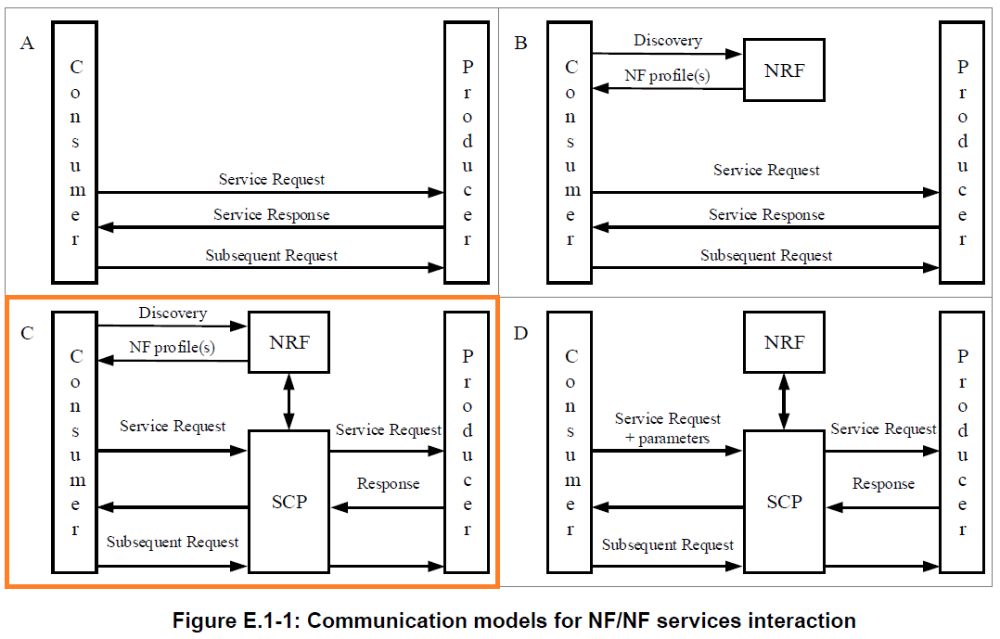

# Open5GS 5GC & UERANSIM UE / RAN Sample Configuration - SCP Indirect communication Model C
This describes a very simple configuration that uses Open5GS and UERANSIM for SCP(Service Communication Proxy) Indirect communication Model C.

---

<h2 id="toc">Table of Contents</h2>

- [Overview of Open5GS 5GC Simulation Mobile Network](#overview)
- [Additional changes in configuration files of Open5GS 5GC C-Plane](#changes_cp)
- [Run Open5GS 5GC C-Plane](#run_cp)
- [Process a pcap file with 5G Trace Visualizer](#5g_trace_visualizer)
- [Changelog (summary)](#changelog)

---
<h2 id="overview">Overview of Open5GS 5GC Simulation Mobile Network</h2>

This is an additional setting example when applying SCP Model C for the following sample configuration.

- [Open5GS 5GC & UERANSIM UE / RAN Sample Configuration - Select UPF based on S-NSSAI](https://github.com/s5uishida/open5gs_5gc_ueransim_snssai_upf_sample_config)

SCP is described in 3GPP TS 23.501 6.2.19, 6.3.16 and Annex E.1 General, and Model C is shown in the figure below.

</img>  
***(Reference source: 3GPP TS 23.501 Annex E.1 General)***

The 5GC / UE / RAN used are as follows.
- 5GC - Open5GS v2.4.9 - https://github.com/open5gs/open5gs
- UE / RAN - UERANSIM v3.2.6 - https://github.com/aligungr/UERANSIM

The SBI addresses of NRF and SCP are as follows.
| NF | IP address on SBI |
| --- | --- |
| NRF | 127.0.0.10 |
| SCP | 127.0.1.10 |

<h2 id="changes_cp">Additional changes in configuration files of Open5GS 5GC C-Plane</h2>

In this case, the following configuration is further changed for SCP Model C.

- [Open5GS 5GC & UERANSIM UE / RAN Sample Configuration - Select UPF based on S-NSSAI](https://github.com/s5uishida/open5gs_5gc_ueransim_snssai_upf_sample_config)

I will explain what to set additionally here.
When using SCP, change the following configuration files for each NF of C-Plane.
- `open5gs/install/etc/open5gs/*.yaml`
```
amf.yaml
ausf.yaml
bsf.yaml
nssf.yaml
pcf.yaml
smf1.yaml smf2.yaml
udm.yaml
udr.yaml
```
The contents to be changed in each NF are the same, so the changes in `ausf.yaml` are shown below.
```diff
--- ausf.yaml.orig      2022-08-04 20:22:09.222046717 +0900
+++ ausf.yaml   2022-08-04 20:46:19.747846735 +0900
@@ -141,7 +141,11 @@
     sbi:
       - addr:
           - 127.0.0.10
-          - ::1
+        port: 7777
+
+scp:
+    sbi:
+      - addr: 127.0.1.10
         port: 7777
 
 #
```
In addition, I removed the IPv6 address `::1` on SBI from the configuration files.
The reason is that `::1` could not be handled properly when taking the pcap file and convert 5G protocol traces info SVG sequence diagrams using [5G Trace Visualizer](https://github.com/telekom/5g-trace-visualizer). Therefore, in this case, set it so that IPv6 is not used.

- `open5gs/install/etc/open5gs/nrf.yaml`

And change `nrf.yaml` as follows.
```diff
--- nrf.yaml.orig       2022-08-04 20:22:09.164046273 +0900
+++ nrf.yaml    2022-08-04 20:49:31.213976148 +0900
@@ -91,7 +91,6 @@
     sbi:
       addr:
         - 127.0.0.10
-        - ::1
       port: 7777
 
 #
```

- `open5gs/install/etc/open5gs/scp.yaml`

Also change `scp.yaml`.
```diff
--- scp.yaml.orig       2022-08-04 20:22:09.193046495 +0900
+++ scp.yaml    2022-08-04 20:51:18.153636042 +0900
@@ -164,7 +164,6 @@
     sbi:
       - addr:
           - 127.0.0.10
-          - ::1
         port: 7777
 
 #
```

<h2 id="run_cp">Run Open5GS 5GC C-Plane</h2>

Run Open5GS 5GC C-Plane adding `open5gs-scpd`.
```
./install/bin/open5gs-nrfd &
sleep 5
./install/bin/open5gs-scpd &
sleep 5
./install/bin/open5gs-smfd -c install/etc/open5gs/smf1.yaml &
./install/bin/open5gs-smfd -c install/etc/open5gs/smf2.yaml &
./install/bin/open5gs-amfd &
./install/bin/open5gs-ausfd &
./install/bin/open5gs-udmd &
./install/bin/open5gs-udrd &
./install/bin/open5gs-pcfd &
./install/bin/open5gs-nssfd &
./install/bin/open5gs-bsfd &
```

<h2 id="5g_trace_visualizer">Process a pcap file with 5G Trace Visualizer</h2>

During 5G communication, you will obtain a pcap file on C-Plane VM by `tcpdump` and then convert 5G protocol traces into SVG sequence diagrams using [5G Trace Visualizer](https://github.com/telekom/5g-trace-visualizer).

In this case, I got the pcap file in the following scenario of 5G communication.
```
              C-Plane started
                         |
                         V
             U-Plane1 started
                         |
                         V
             U-Plane2 started
                         |
                         V
               gNodeB started
                         |
                         V
UE(SST:1,SD:0x000001) started
                         |
                         V
                       ping google.com -I uesimtun0 -n
                         |
                         V
UE(SST:1,SD:0x000001) stopped
                         |
                         V
UE(SST:1,SD:0x000002) started
                         |
                         V
                       ping google.com -I uesimtun0 -n
                         |
                         V
UE(SST:1,SD:0x000002) stopped
```
And processed the pcap file as follows.
```
python3 trace_visualizer.py -wireshark "OS" -http2ports "1000-65535" <pcap file>
```
If necessary, add the following options to make the easy-to-read diagrams.
(there are other options)
```
-show_timestamp True -simple_diagrams True
```
I put a sample pcap and SVG files into [here](./files/).
As for the pcap file, you can download it and view it with your local Wireshark.
Also, for SVG files, you can view an enlarged sequence diagram by following the link of each file and pressing the `Raw` button on Github.

---
I was able to confirm the very simple configuration for SCP Model C.
I would like to thank the excellent developers and all the contributors of Open5GS and UERANSIM.

<h2 id="changelog">Changelog (summary)</h2>

- [2022.08.04] Initial release.
